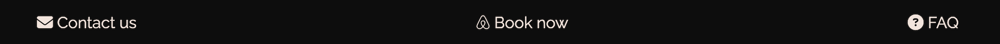

# Pepe Beach Haven

The website serves as an advertisement for vacation rentals targeted at tourists seeking accommodation in Rio de Janeiro, Brazil, particularly in the Barra da Tijuca neighborhood and the Pepe Beach area (Praia do Pepe). Visitors to the site can access valuable information about the accommodation, view photos of the rooms, learn how to rent the apartment, discover details about the surrounding area, and find answers to frequently asked questions.

## CONTENTS

* [User Experience](#user-experience-ux)
  * [User Stories](#user-stories)

* [Design](#design)
  * [Colour Scheme](#colour-scheme)
  * [Typography](#typography)
  * [Imagery](#imagery)
  * [Wireframes](#wireframes)
  * [Features](#features)
    * [The Home Page](#the-home-page)
    * [The Game Page](#the-game-page)
    * [The High Scores Page](#the-high-scores-page)
    * [The 404 Error Page](#the-404-error-page)
    * [Future Implementations](#future-implementations)
  * [Accessibility](#accessibility)

* [Technologies Used](#technologies-used)
  * [Languages Used](#languages-used)
  * [Frameworks, Libraries & Programs Used](#frameworks-libraries--programs-used)

* [Deployment & Local Development](#deployment--local-development)
  * [Deployment](#deployment)
  * [Local Development](#local-development)
    * [How to Fork](#how-to-fork)
    * [How to Clone](#how-to-clone)

* [Testing](#testing)
  * [Solved Bugs](#solved-bugs)
  * [Known Bugs](#known-bugs)
  
* [Credits](#credits)
  * [Code Used](#code-used)
  * [Content](#content)
  * [Media](#media)
  * [Acknowledgments](#acknowledgments)

## Features 

### Existing Features

- __Navigation Bar__

  - Featured on all four pages, the fully responsive navigation bar includes links to the Logo, Home page, Accommodation's Photos, Frequently Asked Questions (FAQ), and Contact page. It remains identical on each page to facilitate easy navigation.
  - This section enables users to effortlessly navigate from page to page across all devices without needing to rely on the "back" button to return to the previous page.

- __The landing page image__

  - The landing page features a photograph with text overlay to provide users with an understanding of what the website offers: a vacation rental, a "home away from home."
  - The selected photograph is highly inviting and evokes a desire to be in a beautiful location.

- __Reasons section__

  - The "Reasons" section highlights to the user the advantages of staying in the advertised accommodation.
  - The user will be enticed to stay at the apartment to enjoy all the listed benefits, including proximity to the beach, reliable internet access, nearby shops, bars, and restaurants, as well as stunning views.

- __The Map__

  - The map displays the precise location of the building where the accommodation is situated.
  - The user can then view the area and the distances to various locations they may be planning to visit, providing them with valuable information for their trip.

- __The Footer__ 

  - The footer section contains useful internal links to a contact form and a FAQ page. Additionally, it includes an external link that directs the user to the Airbnb page where the apartment is listed and available for booking.
  - The external link will open in a new tab to facilitate easy navigation and ensure that the user remains on the website.

- __Accomodation photos__

  - On this page, the user can view photos of the apartment where they will be staying.
  - The photos of the same room are grouped together for better visualization.

- __The FAQ Page__

  - On the FAQ page, users can find answers to common questions regarding what is permitted and what is not, as well as information about parking, check-in and checkout times, and the best way to reach the accommodation, among other details.
  - This section is important because it may help the user with the decision to proceed with booking the accommodation.

- __The Contact Us Page__

  - The form allows users to send a message and directly get in touch with the owner of the apartment.

  - Hover effects have been added to the form when acessed from computers. This enhances user experience by clearly indicating which field is active, thus facilitating the task of filling out the form.
  - The images below illustrate the hover effect on the text fields and on the send button, where the button appears blue when inactive and white when active.

### Features Left to Implement

  - Multi-language support providing translation to multiple languages to meet the needs of a wider audience of international travelers.
  - Link or widget to display the weather forecast.
  - Local Area Guide: Provide a comprehensive guide to the local area, including information on nearby attractions, activities, and amenities.
  - A list of available amenities and electronic appliances.
  - A link or embedded video of a webcam with live images of the beach (user-controlled to prevent bad user experience).

## User Experience (UX)

### User Stories

  - As a traveler planning a trip to Rio de Janeiro:
    - I want to easily find and book accommodation so I can have a comfortable place to stay during my visit.
    - I want to view high-quality photos and detailed descriptions of available apartments, so I can make an informed decision about where to stay.
    - I want to access practical information about the surrounding area to help plan my activities during my stay.
    - I want to easily find answers to frequently asked questions (FAQs) such as check-in process, and policies.

## Design

### Colour Scheme

I wanted the chosen picture to be featured on the front page as the basis for selecting the color theme for the website. To accomplish this, I utilized the [Adobe Colors - Extract Theme](https://color.adobe.com/create/image) tool.

- I have maintained consistency throughout the website by following the same color scheme, ensuring a pleasant user experience. The colors used were:
  - #023859 for the background color of the body.
  - #f2e4dc for the text color on the body and footer, as well as for the background color of the header (logo and navigation menu).
  - #0d0d0d for the text color of the header (logo and navigation menu) and footer.

  

### Typography

Google Fonts were utilized to import the selected fonts for use on the website.

- [DM Serif Display](https://fonts.google.com/specimen/DM+Serif+Display?query=dm+serif) was used for the headings for being a good contrasting font to be used in combination with [Raleway](https://fonts.google.com/specimen/Raleway?query=Raleway), which was chosen for the rest of the text content due to its sleek and modern design, as well as its excellent readability.
 - For the headings, Verdana was chosen as a browser-safe font, while Arial was used for the body text. Sans-serif was designated as the fallback font for both.

DM Serif Display example: 

Raleway example

### Imagery

Since the website serves as an advertisement for an accommodation located at Pepe Beach, I aimed for a photo specifically showcasing this area of Rio. This decision was made deliberately to accurately represent the accommodation's location and to highlight the unique atmosphere offered by Pepe Beach, distinct from the internationally renowned Copacabana and Ipanema beaches.

### Wireframes

Wireframes were initially created for both mobile and desktop versions using Balsamiq. However, during the website development process adjustments were made resulting in alterations to the layout and the number of pages. As a result, the wireframes do not perfectly match the final product, but they served as a foundational guide throughout the development process.

## Desktop wireframes:

  

## Mobile wireframes:

  

## Technologies Used

### Languages Used

- HTML and CSS

### Frameworks, Libraries & Programs Used

- [Adobe Color](https://color.adobe.com/) - To generate a color theme using the photograph chhosen for the main page.

- [Balsamiq](https://balsamiq.com/) - To create wireframes.

- [Github](https://github.com/) - To save and store the files for the website.

- [Google Fonts](https://fonts.google.com/) - To import the fonts used on the website.

- [Google Developer Tools](https://developers.google.com/web/tools) - To troubleshoot and test features, solve issues with responsiveness and styling.

- [TinyPNG](https://tinypng.com/) To optimize png and jpg images.

- [Sqoosh app](https://squoosh.app/) To optimize and convert images to webp format.

- [Favicon.io](https://favicon.io/) To create favicon.

- [Am I Responsive?](http://ami.responsivedesign.is/) To diplay the website image on a range of devices.

- [Webpage Spell-Check](https://chrome.google.com/webstore/detail/webpage-spell-check/mgdhaoimpabdhmacaclbbjddhngchjik/related) - a google chrome extension that allows you to spell check your webpage. Used to check the site and the readme for spelling errors.

## Deployment

This section should describe the process you went through to deploy the project to a hosting platform (e.g. GitHub) 

- The site was deployed to GitHub pages. The steps to deploy are as follows: 
  - In the GitHub repository, navigate to the Settings tab 
  - From the source section drop-down menu, select the Master Branch
  - Once the master branch has been selected, the page will be automatically refreshed with a detailed ribbon display to indicate the successful deployment. 

The live link can be found here - https://code-institute-org.github.io/love-running-2.0/index.html 

## Deployment & Local Development

### Deployment

The site is deployed using GitHub Pages - [The Quiz Arms](https://kera-cudmore.github.io/TheQuizArms/).

To Deploy the site using GitHub Pages:

1. Login (or signup) to Github.
2. Go to the repository for this project, [kera-cudmore/TheQuizArms](https://github.com/kera-cudmore/TheQuizArms).
3. Click the settings button.
4. Select pages in the left hand navigation menu.
5. From the source dropdown select main branch and press save.
6. The site has now been deployed, please note that this process may take a few minutes before the site goes live.

### Local Development

#### How to Fork

To fork the repository:

1. Log in (or sign up) to Github.
2. Go to the repository for this project, [kera-cudmore/TheQuizArms](https://github.com/kera-cudmore/TheQuizArms)
3. Click the Fork button in the top right corner.

#### How to Clone

To clone the repository:

1. Log in (or sign up) to GitHub.
2. Go to the repository for this project, [kera-cudmore/TheQuizArms](https://github.com/kera-cudmore/TheQuizArms)
3. Click on the code button, select whether you would like to clone with HTTPS, SSH or GitHub CLI and copy the link shown.
4. Open the terminal in your code editor and change the current working directory to the location you want to use for the cloned directory.
5. Type 'git clone' into the terminal and then paste the link you copied in step 3. Press enter.

## Testing

Please refer to [TESTING.md](TESTING.md) file for all testing carried out.

## Fixed bugs
During the test phase a few bugs were detected and corrected accordingly:
1. The logo and the logo text wouldn't align nicely, so after trying numerous approaches the problem was fixed by using `position: relative;` and definig the distance to the bottom `bottom: 16px;` for the logo's text;
2. The nav toggle showed the same missalignment and the same approach was used to fix it;
3. The mountain on the homepage's image would be cropped on very large screens (1600px) and it didn't look as good. To fix the problem a media query was created for very large screens with a rule with a larger the height for the image;
4. The background color of the containers on the reasons section as well as the container that groups the photos on the accommodation page and the container of the form on contact and the message on the "thank you" pages didn't offer enough contrast making the text difficult to read. To fix this issue, the transparency was reduced and it created more contrast while still adding a nice look on the pages;
5. The embedded Google Maps would not cover the width of the page. The fix for the problem was to set a ` width: 100%;` on a css rule for the iframe element;
6. The photos on the accommodation page were not displaying nicely when looked on larger screens. To remediate the situation, the order of the room's photos was changed using the css "order" property.
7. During the Mid-Point Project Review call with my mentor it was pointed out that the contact us form could be submitted with an empty space on the First name and Last name fields,even though the "required" property was present in the input elements. After looking online on how to solve the problem, the following solution was found on the [Stackoverflow website](https://stackoverflow.com/questions/13766015/is-it-possible-to-configure-a-required-field-to-ignore-white-space) and the following attributes were added to the input elements: `required pattern=".*\S+.*" title="This field is required"`.
8. The navigation menu was not nicely aligned when the site was visited using the Mozilla Firefox browser.

To fix this problem a new css rule was used on the nav-menu selector `align-self: flex-end;`:

## Unfixed Bugs

1. The fix for problem 7 cannot be used for the "textarea" element and therefore it is possible to submit the form without a message on it. So far I couldn't find a solution for this problem using exclusively html language and I believe the use of aditional programming, using JavaScript would be necessary to fix this problem.

## Credits

### Code Used

* I used [this You Tube tutorial](https://www.youtube.com/watch?v=XH5OW46yO8I) to learn how to create a modal for the how to play section.

* As the API I used for the questions declared the correct answer and then had an array of incorrect answers, I had to find a way to shuffle the answers together so that the correct answer wouldn't always appear on the same button. Research led me to the Fisher-Yates Shuffle. Other methods of shuffling can favour some items in the array more than others, however the Fisher Yates Shuffle allows for a more even spread of probability of the answer being placed on each button. I used the following [YouTube tutorial](https://www.youtube.com/watch?v=eATLMjs7y4s&list=PL5egNEXQTWmFHAoWFVRLNAvD-9zzyWVxA&index=3) to further adapt the shuffle I had researched on W3Schools to work with the data I had.

As the JavaScript modules of the Code Institute Diploma did not cover local storage, I had to do a bit of research into this topic myself in order to set up the high scores section of my site.

* I used this [video tutorial](https://www.youtube.com/watch?v=DFhmNLKwwGw&list=PLDlWc9AfQBfZIkdVaOQXi1tizJeNJipEx&index=9) on YouTube by [James Q Quick](https://www.youtube.com/channel/UC-T8W79DN6PBnzomelvqJYw) which taught me to save the team name and score to an object, that would then be saved into an array in local storage. It also explained how to sort the items in the array into descending score order, and then to splice the array, I have used the MAX_HIGH_SCORES as my point to splice.

* I used this [video tutorial](https://www.youtube.com/watch?v=jfOv18lCMmw&list=PLDlWc9AfQBfZIkdVaOQXi1tizJeNJipEx&index=10) on YouTube by [James Q Quick](https://www.youtube.com/channel/UC-T8W79DN6PBnzomelvqJYw) to learn how to insert the local storage into the high scores page.

### Content

Readme documentation was inspired by both sample README from Code Institue and the README files from Kera Cudmore for being so complete and well written.

All other content for the site, such as introduction messages and instructions were written by myself.

### Media

[Page background image of a pub](https://pixabay.com/photos/bar-pub-cafe-establishment-stools-2209813/)

### Acknowledgments

I would like to acknowledge the following people:

* Jubril Akolade - My Code Institute Mentor.

* Kera Cudmore - For providing a great webinar and plenty of material on how to write a good README.

* The Code Institute Slack channel for helping me to find a solution for my problems.

Congratulations on completing your Readme, you have made another big stride in the direction of being a developer! 

## Other General Project Advice

Below you will find a couple of extra tips that may be helpful when completing your project. Remember that each of these projects will become part of your final portfolio so it’s important to allow enough time to showcase your best work! 

- One of the most basic elements of keeping a healthy commit history is with the commit message. When getting started with your project, read through [this article](https://chris.beams.io/posts/git-commit/) by Chris Beams on How to Write  a Git Commit Message 
  - Make sure to keep the messages in the imperative mood 

- When naming the files in your project directory, make sure to consider meaningful naming of files, point to specific names and sections of content.
  - For example, instead of naming an image used ‘image1.png’ consider naming it ‘landing_page_img.png’. This will ensure that there are clear file paths kept. 

- Do some extra research on good and bad coding practices, there are a handful of useful articles to read, consider reviewing the following list when getting started:
  - [Writing Your Best Code](https://learn.shayhowe.com/html-css/writing-your-best-code/)
  - [HTML & CSS Coding Best Practices](https://medium.com/@inceptiondj.info/html-css-coding-best-practice-fadb9870a00f)
  - [Google HTML/CSS Style Guide](https://google.github.io/styleguide/htmlcssguide.html#General)

Getting started with your Portfolio Projects can be daunting, planning your project can make it a lot easier to tackle, take small steps to reach the final outcome and enjoy the process! 

[def]: documentation/am-i-responsive-index.png