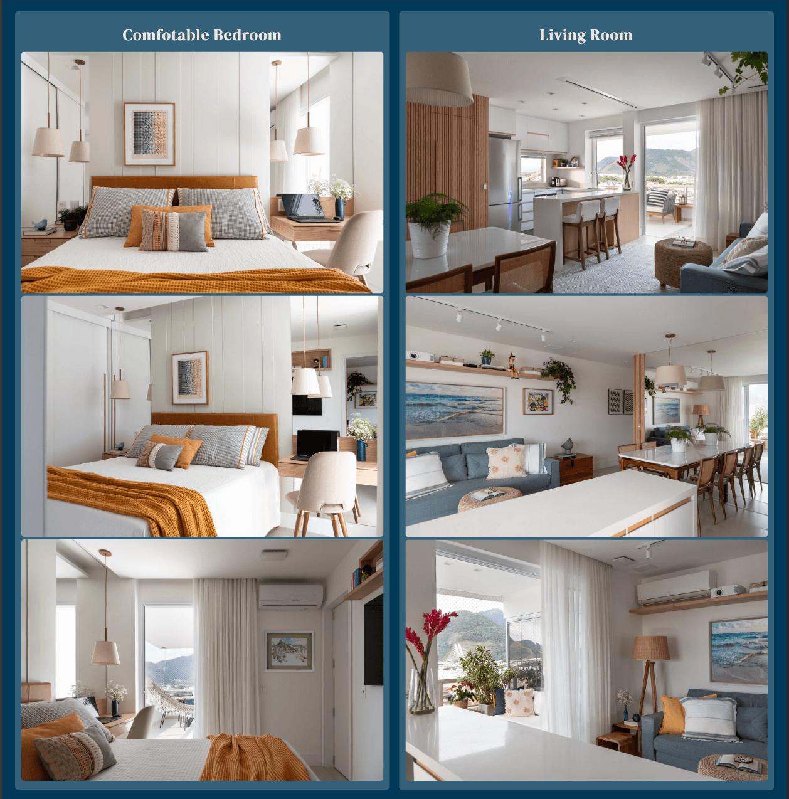

# Pepe Beach Haven

The website is an advertising for a vacation rental and it is targeted for turists looking for accomodation in Rio de Janeiro, Brazil, more specifically in a neighborhood called Barra da Tijuca and a beach area called Pepe Beach (Praia do Pepe). On the site the user can find valuable information about the accomodation itself, see photos of the rooms, get information about how to rent the appartment, the area where it is located and find answers to frequently asked questions.

## Features 

### Existing Features

- __Navigation Bar__

  - Featured on all four pages, the full responsive navigation bar includes links to the Logo, Home page, Accommodation's photos, frequently asked questions (FAQ) and contact page. It is identical in each page to allow for easy navigation.
  - This section allows the user to easily navigate from page to page across all devices without having to revert back to the previous page via the ‘back’ button.

- __The landing page image__

  - The landing includes a photograph with text overlay to allow the user to understand what the website is about: A vacation rental, the "home away from home".
  - The photograph chosen is very inviting and awakens the desire to be somewhere nice.

- __Reasons section__

  - The reasons section points out to the user the advantages of staying in the accommodation beign advertised.
  - The user is going to want to stay at that appartament so that they have access to all the listed benefits, such as the proximity to the beach, good internet quality, shops, bars and restaurants nearby and the views.

- __The Map__

  - The map shows the exact location of the building where the accomodation is situated.
  - The user can than see the area and the distances to different locations he may be planing on going to for instance.

- __The Footer__ 

  - The footer section includes useful internal links to a contact form and a FAQ page It also includes an external link, that takes the user to the airbnb page where the appartament is listed and can be actually booked.
  - The external link will open to a new tab to allow easy navigation and keep the user on the website.

- __Accomodation photos__

  - In this page the user can see the photos of the appartament where they he going to stay.
  - The photos of the one same room are grouped for better visualization.

- __The FAQ Page__

  - On the FAQ page the user can find answers to common questions about what is allowed and what is not, and information about parking, check-in and checkout times and what is the best way to get there for instance.
  - This section is important because it may help the user to take the decision of going ahead and booking the accommodation.

- __The Contact Us Page__

  - This page will allow the user to get signed up to Love Running to start their running journey with the community. The user will be able specify if they would like to take part in road, trail or both types of running. The user will be asked to submit their full name and email address. 

  - The form allows the user to send a message and get in touch directly with the owner of the apartament.
  - On the form there were some hover effects added for computers, where the user interacts with the form by using the mouse or the 'Tab' key. This way the user can clearly identify which field is active facilitating the task of filling up the form.
  - The images below depict the hover effect on the text field and on the send button (blue inactive and white active)

### Features Left to Implement

- Add link or widget to show the weather forecast.
- Add page with information and ideas of what to do in the area and sitgh seeing tours.
- Add a list of available amenities and electro-electronics.
- Add language options for the whole website.
- Add link or embedded video of a webcam with live images of the beach (start to be controled bu the user to avoid bad user experience)

## [Testing](TESTING.md)

The testing section was saved as a separate file, to access it, just click the Heading "Testing" of the current section.

## Deployment

This section should describe the process you went through to deploy the project to a hosting platform (e.g. GitHub) 

- The site was deployed to GitHub pages. The steps to deploy are as follows: 
  - In the GitHub repository, navigate to the Settings tab 
  - From the source section drop-down menu, select the Master Branch
  - Once the master branch has been selected, the page will be automatically refreshed with a detailed ribbon display to indicate the successful deployment. 

The live link can be found here - https://code-institute-org.github.io/love-running-2.0/index.html 

## Credits 

The Favicon used was Designed by vectorstock

In this section you need to reference where you got your content, media and extra help from. It is common practice to use code from other repositories and tutorials, however, it is important to be very specific about these sources to avoid plagiarism. 

You can break the credits section up into Content and Media, depending on what you have included in your project. 

### Content 

- 
- Instructions on how to implement form validation on the Sign Up page was taken from the lessons from CSS Module of the Code Institute Course.
- The icons in the footer were taken from [Font Awesome](https://fontawesome.com/)

### Media

- The photos used on the home and sign up page are from This Open Source site
- The images used for the gallery page were taken from this other open source site

Congratulations on completing your Readme, you have made another big stride in the direction of being a developer! 

## Other General Project Advice

Below you will find a couple of extra tips that may be helpful when completing your project. Remember that each of these projects will become part of your final portfolio so it’s important to allow enough time to showcase your best work! 

- One of the most basic elements of keeping a healthy commit history is with the commit message. When getting started with your project, read through [this article](https://chris.beams.io/posts/git-commit/) by Chris Beams on How to Write  a Git Commit Message 
  - Make sure to keep the messages in the imperative mood 

- When naming the files in your project directory, make sure to consider meaningful naming of files, point to specific names and sections of content.
  - For example, instead of naming an image used ‘image1.png’ consider naming it ‘landing_page_img.png’. This will ensure that there are clear file paths kept. 

- Do some extra research on good and bad coding practices, there are a handful of useful articles to read, consider reviewing the following list when getting started:
  - [Writing Your Best Code](https://learn.shayhowe.com/html-css/writing-your-best-code/)
  - [HTML & CSS Coding Best Practices](https://medium.com/@inceptiondj.info/html-css-coding-best-practice-fadb9870a00f)
  - [Google HTML/CSS Style Guide](https://google.github.io/styleguide/htmlcssguide.html#General)

Getting started with your Portfolio Projects can be daunting, planning your project can make it a lot easier to tackle, take small steps to reach the final outcome and enjoy the process! 

[def]: documentation/am-i-responsive-index.png