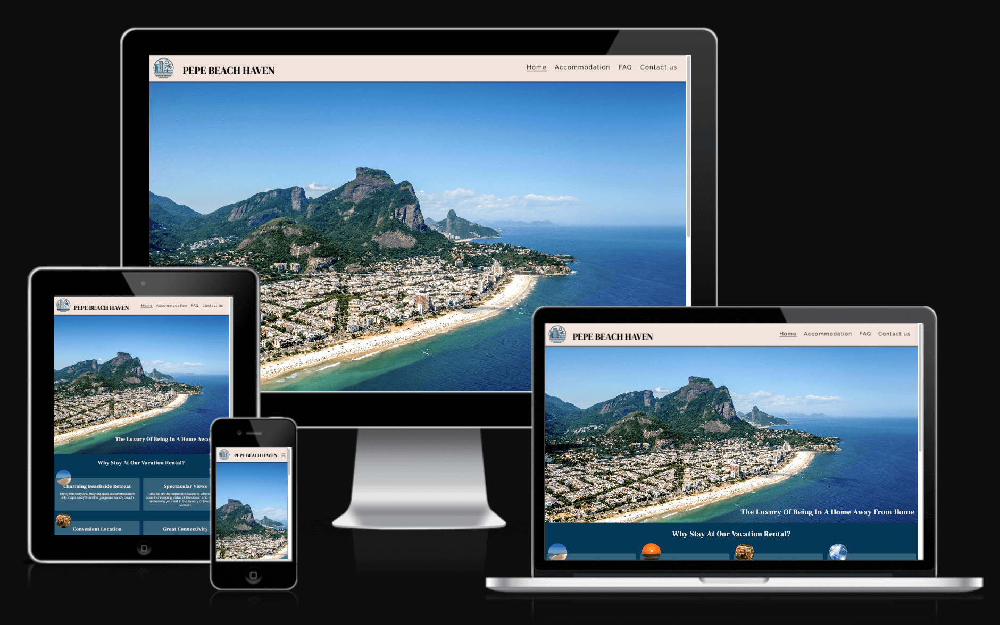
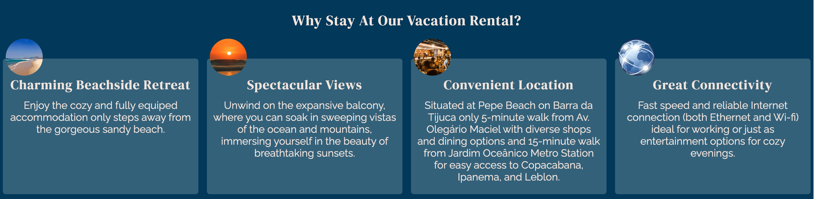

# Pepe Beach Haven

The website serves as an advertisement for vacation rentals targeted at tourists seeking accommodation in Rio de Janeiro, Brazil, particularly in the Barra da Tijuca neighborhood and the Pepe Beach area (Praia do Pepe). Visitors to the site can access valuable information about the accommodation, view photos of the rooms, learn how to rent the apartment, discover details about the surrounding area, and find answers to frequently asked questions.

## CONTENTS
# Table of Contents

1. [Features](#features)
   - [Existing Features](#existing-features)
   - [Features Left to Implement](#features-left-to-implement)
2. [User Experience (UX)](#user-experience-ux)
   - [User Stories](#user-stories)
3. [Design](#design)
   - [Color Scheme](#color-scheme)
   - [Typography](#typography)
   - [Imagery](#imagery)
   - [Wireframes](#wireframes)
4. [Technologies Used](#technologies-used)
   - [Languages Used](#languages-used)
   - [Frameworks, Libraries & Programs Used](#frameworks-libraries--programs-used)
5. [Deployment and Local Deployment](#deployment-and-local-deployment)
   - [Deployment](#deployment)
   - [Local Development](#local-development)
6. [Testing](#testing)
   - [Fixed Bugs](#fixed-bugs)
   - [Unfixed Bugs](#unfixed-bugs)
7. [Credits](#credits)
   - [Code Used](#code-used)
   - [Content](#content)
   - [Media](#media)
   - [Acknowledgments](#acknowledgments)

## Features 

### Existing Features

- __Navigation Bar__

  - Featured on all four pages, the fully responsive navigation bar includes links to the Logo, Home page, Accommodation's Photos, Frequently Asked Questions (FAQ), and Contact page. It remains identical on each page to facilitate easy navigation.
  - This section enables users to effortlessly navigate from page to page across all devices without needing to rely on the "back" button to return to the previous page.

- __The landing page image__

  - The landing page features a photograph with text overlay to provide users with an understanding of what the website offers: a vacation rental, a "home away from home."
  - The selected photograph is highly inviting and evokes a desire to be in a beautiful location.

- __Reasons section__

  - The "Reasons" section highlights to the user the advantages of staying in the advertised accommodation.
  - The user will be enticed to stay at the apartment to enjoy all the listed benefits, including proximity to the beach, reliable internet access, nearby shops, bars, and restaurants, as well as stunning views.

- __The Map__

  - The map displays the precise location of the building where the accommodation is situated.
  - The user can then view the area and the distances to various locations they may be planning to visit, providing them with valuable information for their trip.

- __The Footer__ 

  - The footer section contains useful internal links to a contact form and a FAQ page. Additionally, it includes an external link that directs the user to the Airbnb page where the apartment is listed and available for booking.
  - The external link will open in a new tab to facilitate easy navigation and ensure that the user remains on the website.

- __Accomodation photos__

  - On this page, the user can view photos of the apartment where they will be staying.
  - The photos of the same room are grouped together for better visualization.

- __The FAQ Page__

  - On the FAQ page, users can find answers to common questions regarding what is permitted and what is not, as well as information about parking, check-in and checkout times, and the best way to reach the accommodation, among other details.
  - This section is important because it may help the user with the decision to proceed with booking the accommodation.

- __The Contact Us Page__

  - The form allows users to send a message and directly get in touch with the owner of the apartment.

  - Hover effects have been added to the form when acessed from computers. This enhances user experience by clearly indicating which field is active, thus facilitating the task of filling out the form.
  - The images below illustrate the hover effect on the text fields and on the send button, where the button appears blue when inactive and white when active.

### Features Left to Implement

  - Multi-language support providing translation to multiple languages to meet the needs of a wider audience of international travelers.
  - Link or widget to display the weather forecast.
  - Local Area Guide: Provide a comprehensive guide to the local area, including information on nearby attractions, activities, and amenities.
  - A list of available amenities and electronic appliances.
  - A link or embedded video of a webcam with live images of the beach (user-controlled to prevent bad user experience).

## User Experience (UX)

### User Stories

  - As a traveler planning a trip to Rio de Janeiro:
    - I want to easily find and book accommodation so I can have a comfortable place to stay during my visit.
    - I want to view high-quality photos and detailed descriptions of available apartments, so I can make an informed decision about where to stay.
    - I want to access practical information about the surrounding area to help plan my activities during my stay.
    - I want to easily find answers to frequently asked questions (FAQs) such as check-in process, and policies.

## Design

### Colour Scheme

I wanted the chosen picture to be featured on the front page as the basis for selecting the color theme for the website. To accomplish this, I utilized the [Adobe Colors - Extract Theme](https://color.adobe.com/create/image) tool.

- I have maintained consistency throughout the website by following the same color scheme, ensuring a pleasant user experience. The colors used were:
  - #023859 for the background color of the body.
  - #f2e4dc for the text color on the body and footer, as well as for the background color of the header (logo and navigation menu).
  - #0d0d0d for the text color of the header (logo and navigation menu) and footer.

  

### Typography

Google Fonts were utilized to import the selected fonts for use on the website.

- [DM Serif Display](https://fonts.google.com/specimen/DM+Serif+Display?query=dm+serif) was used for the headings for being a good contrasting font to be used in combination with [Raleway](https://fonts.google.com/specimen/Raleway?query=Raleway), which was chosen for the rest of the text content due to its sleek and modern design, as well as its excellent readability.
 - For the headings, Verdana was chosen as a browser-safe font, while Arial was used for the body text. Sans-serif was designated as the fallback font for both.

DM Serif Display example: 

Raleway example

### Imagery

Since the website serves as an advertisement for an accommodation located at Pepe Beach, I aimed for a photo specifically showcasing this area of Rio. This decision was made deliberately to accurately represent the accommodation's location and to highlight the unique atmosphere offered by Pepe Beach, distinct from the internationally renowned Copacabana and Ipanema beaches.

### Wireframes

Wireframes were initially created for both mobile and desktop versions using Balsamiq. However, during the website development process adjustments were made resulting in alterations to the layout and the number of pages. As a result, the wireframes do not perfectly match the final product, but they served as a foundational guide throughout the development process.

## Desktop wireframes:

  

## Mobile wireframes:

  

## Technologies Used

### Languages Used

- HTML and CSS

### Frameworks, Libraries & Programs Used

- [Adobe Color](https://color.adobe.com/) - To generate a color theme using the photograph chhosen for the main page.

- [Balsamiq](https://balsamiq.com/) - To create wireframes.

- [Github](https://github.com/) - To save and store the files for the website.

- [Google Fonts](https://fonts.google.com/) - To import the fonts used on the website.

- [Google Developer Tools](https://developers.google.com/web/tools) - To troubleshoot and test features, solve issues with responsiveness and styling.

- [TinyPNG](https://tinypng.com/) To optimize png and jpg images.

- [Sqoosh app](https://squoosh.app/) To optimize and convert images to webp format.

- [Favicon.io](https://favicon.io/) To create favicon.

- [Am I Responsive?](http://ami.responsivedesign.is/) To diplay the website image on a range of devices.

- [Webpage Spell-Check](https://chrome.google.com/webstore/detail/webpage-spell-check/mgdhaoimpabdhmacaclbbjddhngchjik/related) - a google chrome extension that allows you to spell check your webpage. Used to check the site and the readme for spelling errors.

## Deployment and Local deployment:

### Deployment

- The site was deployed to GitHub pages. The steps taken to deploy were as follows: 
  - Log in (or sign up) to Github.
  - In the GitHub repository, navigate to the Settings tab 
  - Select pages in the left hand navigation menu.
  - From the source dropdown select main branch and press save.
  - The site has now been deployed, please note that this process may take a few minutes before the site goes live.
 

The live link can be found here - [Pepe Beach Haven](https://pswhdev.github.io/pepe-beach-haven/)

### Local Development

#### How to Fork

To fork the repository:

  - Log in (or sign up) to Github.
  - Go to the repository for this project, [pswhdev/Pepe Beach Haven](https://github.com/pswhdev/pepe-beach-haven)
  - Click the Fork button in the top right corner.

#### How to Clone

To clone the repository:

  - Log in (or sign up) to GitHub.
  - Go to the repository for this project, [pswhdev/Pepe Beach Haven](https://github.com/pswhdev/pepe-beach-haven)
  - Click on the code button, select whether you would like to clone with HTTPS, SSH or GitHub CLI and copy the link shown.
  - Open the terminal in your code editor and change the current working directory to the location you want to use for the cloned directory.
  - Type 'git clone' into the terminal and then paste the link you copied from the repository. Press enter.

## Testing

Please refer to [TESTING.md](TESTING.md) file for details on all testing conducted.

## Fixed bugs
During the test phase a few bugs were detected and corrected accordingly:
1. The logo and the logo text initially didn't align nicely. After attempting various approaches, the issue was resolved by utilizing position: relative; and defining the distance to the bottom using bottom: 16px; for the logo's text.
2. The nav toggle showed the same misalignment and the same approach was used to fix it.
3. The mountain on the homepage's image would be cropped on very large screens (1600px) and didn't look as good. To address this issue, a media query was implemented specifically for very large screens, adjusting the height of the image to ensure optimal display.
4. The background color of the containers in the reasons section, the containers grouping the photos on the accommodation page, the container of the form on the contact page and the one enclosing the message on the "thank you" page, didn't offer enough contrast, making the text difficult to read. To address this issue, the transparency was reduced, creating more contrast while still maintaining a visually pleasing appearance on the pages.
5. The embedded Google Maps did not cover the width of the page. The solution to this issue was to apply a CSS rule to the iframe element, setting its width to 100%.
6. The photos on the accommodation page did not display nicely on larger screens. To address this issue, the order of the room's photos was adjusted using the CSS "order" property.
7. During the Mid-Point Project Review call with my mentor, it was noted that the contact us form could be submitted with an empty space in the First Name and Last Name fields, despite the "required" property being present in the input elements. After researching online for a solution, the following solution was found on the  [Stackoverflow website](https://stackoverflow.com/questions/13766015/is-it-possible-to-configure-a-required-field-to-ignore-white-space) and the following attributes were added to the input elements: `required pattern=".*\S+.*" title="This field is required"`.
8. The navigation menu was not nicely aligned when the site was visited using the Mozilla Firefox browser.

To resolve this issue, a new CSS rule was applied to the nav-menu selector, `align-self: flex-end;`:

## Unfixed Bugs

1. The solution implemented for problem 7 cannot be applied to the "textarea" element, allowing the form to be submitted without a message. As of now, no solution has been found using HTML alone. It's likely that additional programming, such as JavaScript, would be necessary to address this issue.

## Credits

### Code Used

- During the development of the website, I utilized code snippets from the "Love Running" and "Coders Coffeehouse" projects provided in the Code Institute Modules.

- I used the CSS Tutorial from [W3Schools](https://www.w3schools.com/) in order to better understand the CSS language.

- I learned how to optimize photos for web use by following [this You Tube tutorial](https://www.youtube.com/watch?v=bfACnNIw2qA&t=613s).

### Content

The documentation in the README file was inspired by both the sample README files provided by Code Institute and the README files authored by Kera Cudmore for the thoroughness and clarity.

Text revisions were made with the assistance from ChatGPT.

### Media

- [Main page background image](https://www.pikist.com/free-photo-ssjyk/download). The photograph on the pikist website was mirrored, and I corrected the mirroring in order to have an accurate image of the beach as it actually is.

- Reasons section Thumbnail Photos:

  - [Sunset photo](https://unsplash.com/photos/the-sun-is-setting-over-the-ocean-with-waves-Yisr9qcGuXM)

  - [Sand Beach](https://jagwire.augusta.edu/barra-da-tijuca-beach/)

  - [Bar](http://www.aquinabarra.com.br/Destaque/184/Gastronomia/Uma-selecao-de-bares-para-amar-a-Olegario-Maciel)

  - [Connectivity](https://upload.wikimedia.org/wikipedia/commons/thumb/7/70/Applications-internet.svg/768px-Applications-internet.svg.png)

- The page's logo was generated using artificial intelligence, specifically DALL·E 3 by OpenAI, accessed through Microsoft's Bing platform.

### Acknowledgments

I would like to acknowledge:

- My mentor, Jubril Akolade, for providing guidance throughout the development process.

- Kera Cudmore for her exemplary README files, which served as a model for the documentation included in this project.

- The Code Institute Slack channel members for helping me find solutions for my problems.