# Pepe Beach Haven Testing

## CONTENTS

1. [Introduction](#introduction)
2. [Responsiveness Test](#responsiveness-test)
3. [Automated Testing](#automated-testing)
    1. [W3C Validator](#w3c-validator)
    2. [Lighthouse Tests](#lighthouse-tests)
4. [Manual Testing](#manual-testing)
    1. [Testing User Stories](#testing-user-stories)
    2. [Full Testing](#full-testing)

A series of manual tests were conducted to ensure the robust functionality and usability of the website. Each project feature, like navigation menu, links and form submissions were carefully examined to ascertain its proper operation and alignment with user needs.

The testing in different  browsers and diverse computers and mobile devices of different sizes and models show the website works reliably and effectively, providing users with a smooth navigation experience.

Visit the deployed site: [Pepe Beach Haven](https://pswhdev.github.io/pepe-beach-haven/)

## Responsiveness test

- Responsiveness tests were conducted manually by accessing the live website using different computer, browsers and mobile devices.

- The website is fully responsive, resizing the content of all pages according to the device's screen sizes, as can be seen in the images below.

    - The home page:
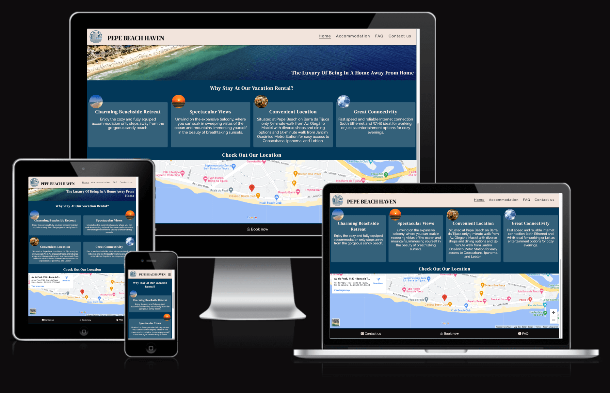

    - The accommodation page:
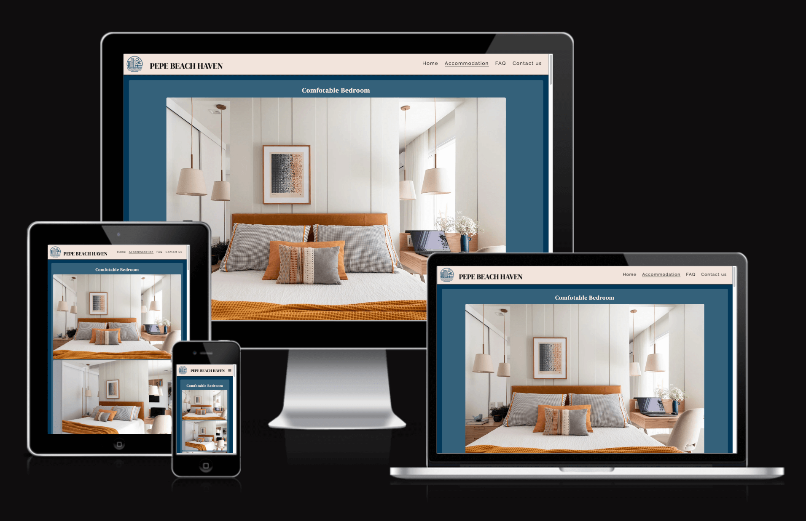

    - The FAQ page:
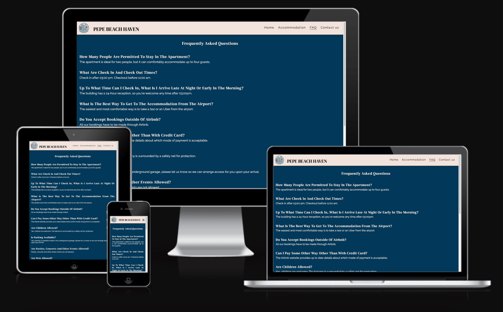

    - The contact us page:
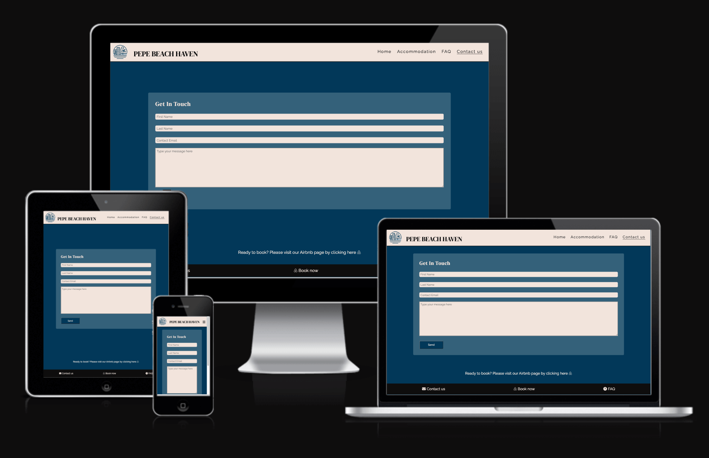

    - The thank you page:
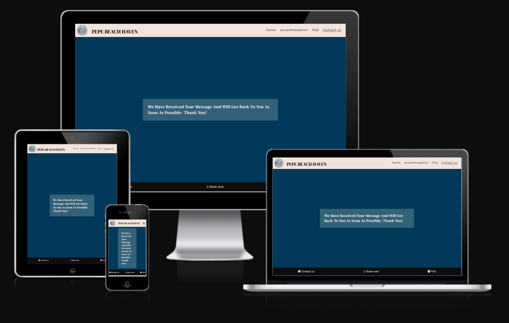

## AUTOMATED TESTING

### W3C Validator

[W3C](https://validator.w3.org/) was used to validate the HTML on all pages of the website. It was also used to validate the CSS.

- HTML:

  - No errors were returned when passing through the official W3C validator:

    - [Home page](https://validator.w3.org/nu/?doc=https%3A%2F%2Fpswhdev.github.io%2Fpepe-beach-haven%2Findex.html)

    - [Accommodation page](https://validator.w3.org/nu/?doc=https%3A%2F%2Fpswhdev.github.io%2Fpepe-beach-haven%2Faccommodation.html)

    - [Faq page](https://validator.w3.org/nu/?doc=https%3A%2F%2Fpswhdev.github.io%2Fpepe-beach-haven%2Ffaq.html)

    - [Contact page](https://validator.w3.org/nu/?doc=https%3A%2F%2Fpswhdev.github.io%2Fpepe-beach-haven%2Fcontact.html)

    - [Thank you page](https://validator.w3.org/nu/?doc=https%3A%2F%2Fpswhdev.github.io%2Fpepe-beach-haven%2Fthank.html)
  
- CSS:

  - No errors were found when passing through the official [(Jigsaw) validator](https://jigsaw.w3.org/css-validator/validator?uri=https%3A%2F%2Fpswhdev.github.io%2Fpepe-beach-haven%2Findex.html&profile=css3svg&usermedium=all&warning=1&vextwarning=&lang=en)

  
### Lighthouse tests:
- All pages were tested using the Lighthouse feature in Dev Tools from Google Chrome. The results can be seen in the pictures below. The pictures with a black background show the results of tests conducted for the desktop version, whereas the ones with a white background show the results of tests for the mobile version:

- Home page:

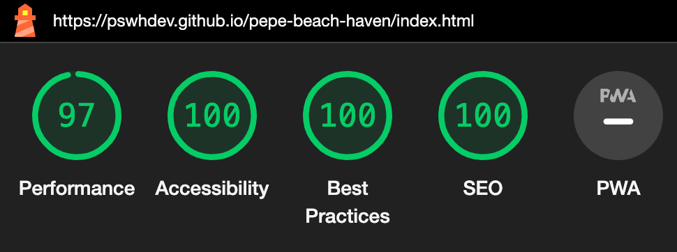

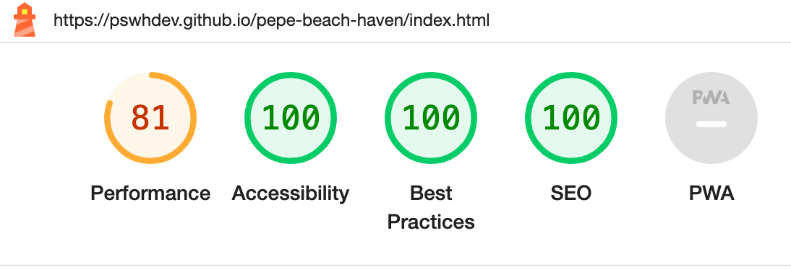

- Accommodation page:

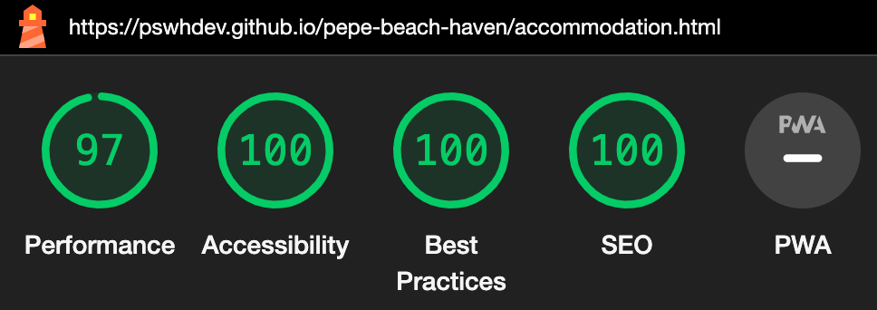

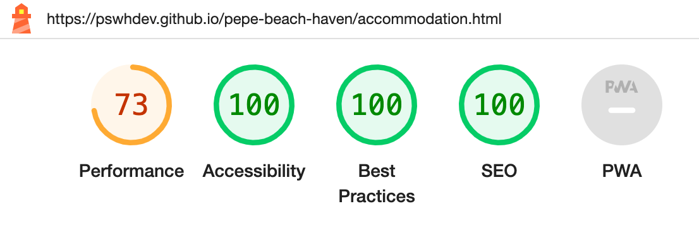

- FAQ page:

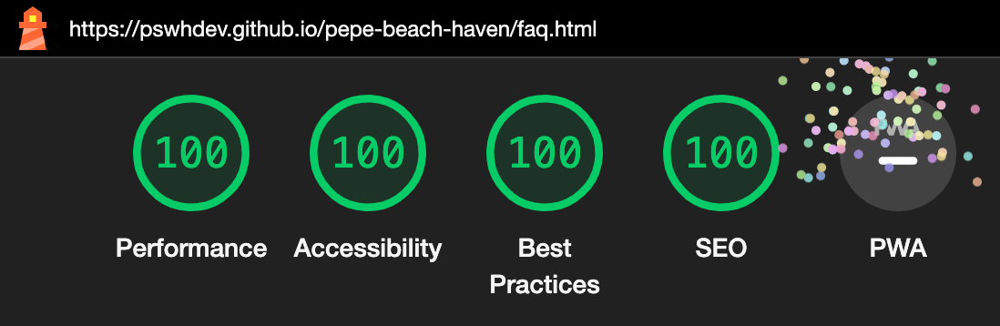

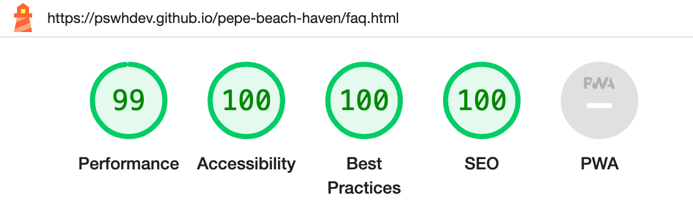

- Contact page:

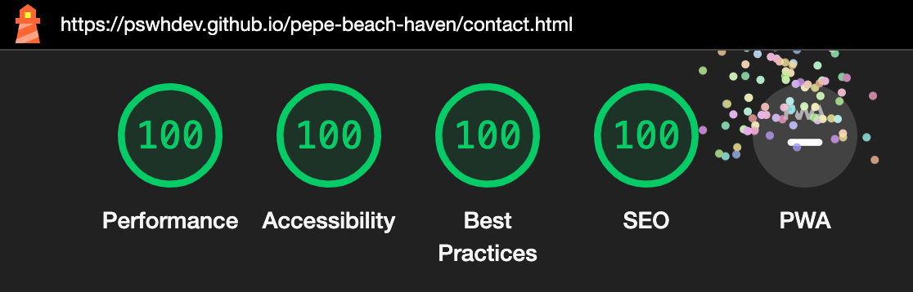

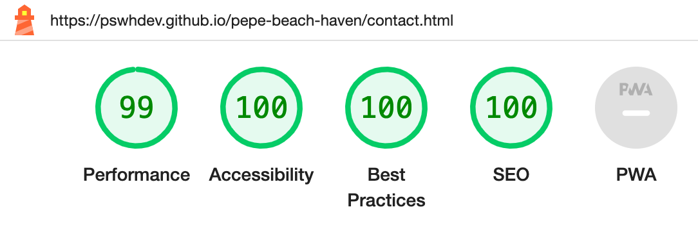

- Thank you page:

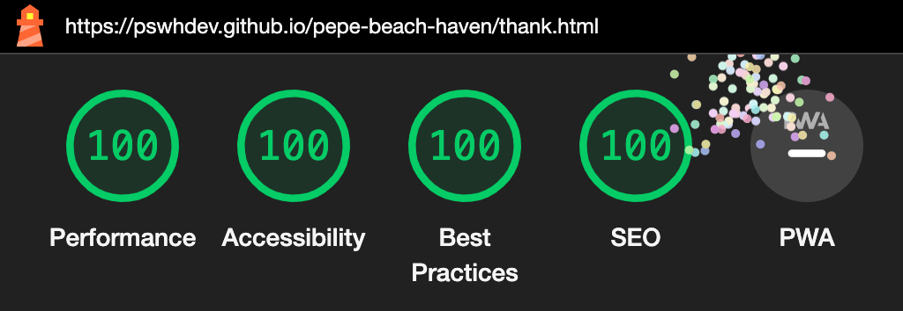

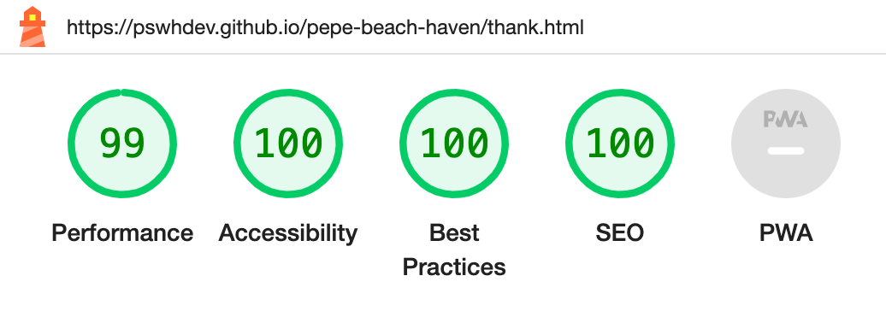

## MANUAL TESTING

### Testing User Stories

- Expectation:
As a traveler planning a trip to Rio de Janeiro:
I want to easily find and book accommodation so I can have a comfortable place to stay during my visit.
- Result:
When I open the website, I see that it is a page advertising a vacation rental. I can easily find the link that redirects me to the Airbnb page where the apartment is listed for booking.

- Expectation:
I want to view high-quality photos of the apartment, so I can decide if it is a place I would like to stay.
- Result:
I can intuitively find the Accommodation section on the navigation menu, which takes me to the accommodation's page with high-resolution photos depicting all the apartment rooms.

- Expectation:
I want to access practical information about the surrounding area to help plan my activities during my stay.
- Result:
On the home page, I can see a functioning map of the area where I can study the surroundings using Google Maps and explore nearby amenities and attractions.

- Expectation:
I want to easily find answers to frequently asked questions (FAQs) such as check-in process, and policies.
- Result:
On the navigation menu and in the page's footer, I see links that redirect me to the FAQ page, where I can find answers to my questions.

### Full Testing

Full testing was performed on the following devices:

- Desktop:
    - Monitor: LG - Flatron W2243S 1920x1080
- Laptop:
    - Macbook Air 13 inch screen
- Tablet:
    - Galaxy Tab S6 Lite
- Mobile Devices:
    - iPhone 12 mini
    - Galaxy Note20

Each device tested the site using the following browsers:

- Google Chrome
- Safari
- Firefox

`Home Page`

 Feature 	|	 Expected Outcome 	|	 Testing Performed 	|	 Result 	|	 Pass/Fail 
 --- 	|	 --- 	|	 --- 	|	 --- 	|	 --- 
 Logo of the page	|	 Loads home page 	|	 Clicked on the logo 	|	 Home page reloads 	|	 Pass 
 Title of the page	|	 Loads the home page 	|	 Clicked on title 	|	 Home page reloads 	|	 Pass 
 Home Navbar Button	|	 Loads the home page 	|	 Clicked on the Home Navbar Button	|	 Home page reloads 	|	 Pass
 Accommodation Navbar Button	|	 Loads the accommodation page 	|	 Clicked on the Accommodation Navbar Button	|	 Goes to Accommodation page 	|	 Pass
 FAQ Navbar Button	|	 Loads the FAQ page 	|	 Clicked on the FAQ Navbar Button	|	 Goes to FAQ page 	|	 Pass
 Contact us Navbar Button	|	 Loads the contact us page 	|	 Clicked on the Contact us Navbar Button	|	 Goes to Contact us page 	|	 Pass
 Airbnb link on footer	|	 Opens an external link to airbnb in a new tab	|	 Clicked on the Airbnb link	|	 Opens an external link to airbnb in a new tab	|	 Pass
 FAQ link on footer	|	 Loads the FAQ page 	|	 Clicked on the FAQ link	|	 Goes to FAQ page 	|	 Pass
 Contact us link on footer	|	 Loads the contact us page 	|	 Clicked on the Contact us link	|	 Goes to Contact us page 	|	 Pass
 Embedded Google Maps	|	 Map is interactive	|	 Clicked on the map	|	 Map is interactive	|	 Pass

 `Accomodation page`

   Feature 	|	 Expected Outcome 	|	 Testing Performed 	|	 Result 	|	 Pass/Fail 
   --- 	|	 --- 	|	 --- 	|	 --- 	|	 --- 
   Logo of the page	|	 Loads home page 	|	 Clicked on the logo 	|	 Goes to Home page 	|	 Pass 
   Title of the page	|	 Loads the home page 	|	 Clicked on title 	|	 Goes to Home page	|	 Pass 
   Home Navbar Button	|	 Loads the home page 	|	 Clicked on the Home Navbar Button	|	 Goes to Home page 	|	 Pass
   Accommodation Navbar Button	|	 Loads the accommodation page 	|	 Clicked on the Accommodation Navbar Button	|	 Accommodation page reloads	|	 Pass
   FAQ Navbar Button	|	 Loads the FAQ page 	|	 Clicked on the FAQ Navbar Button	|	 Goes to FAQ page 	|	 Pass
   Contact us Navbar Button	|	 Loads the contact us page 	|	 Clicked on the Contact us Navbar Button	|	 Goes to Contact us page 	|	 Pass
   Airbnb link on footer	|	 Opens an external link to airbnb in a new tab	|	 Clicked on the Airbnb link	|	 Opens an external link to airbnb in a new tab	|	 Pass
   FAQ link on footer	|	 Loads the FAQ page 	|	 Clicked on the FAQ link	|	 Goes to FAQ page 	|	 Pass
   Contact us link on footer	|	 Loads the contact us page 	|	 Clicked on the Contact us link	|	 Goes to Contact us page 	|	 Pass
  Link to Airbnb on the the body of the page	|	 Opens an external link to airbnb in a new tab	|	 Clicked on the Airbnb link	|	 Opens an external link to airbnb in a new tab	|	 Pass

`FAQ page`

 Feature 	|	 Expected Outcome 	|	 Testing Performed 	|	 Result 	|	 Pass/Fail 
 --- 	|	 --- 	|	 --- 	|	 --- 	|	 --- 
 Logo of the page	|	 Loads home page 	|	 Clicked on the logo 	|	 Goes to Home page 	|	 Pass 
 Title of the page	|	 Loads the home page 	|	 Clicked on title 	|	 Goes to Home page	|	 Pass 
 Home Navbar Button	|	 Loads the home page 	|	 Clicked on the Home Navbar Button	|	 Goes to Home page 	|	 Pass
 Accommodation Navbar Button	|	 Loads the accommodation page 	|	 Clicked on the Accommodation Navbar Button	|	 Goes to Accommodation page	|	 Pass
 FAQ Navbar Button	|	 Loads the FAQ page 	|	 Clicked on the FAQ Navbar Button	|	FAQ page reloads	|	 Pass
 Contact us Navbar Button	|	 Loads the contact us page 	|	 Clicked on the Contact us Navbar Button	|	 Goes to Contact us page 	|	 Pass
 Airbnb link on footer	|	 Opens an external link to airbnb in a new tab	|	 Clicked on the Airbnb link	|	 Opens an external link to airbnb in a new tab	|	 Pass
 FAQ link on footer	|	 Loads the FAQ page 	|	 Clicked on the FAQ link	|	 FAQ page reloads	|	 Pass
 Contact us link on footer	|	 Loads the contact us page 	|	 Clicked on the Contact us link	|	 Goes to Contact us page 	|	 Pass
Link to Airbnb on the the body of the page	|	 Opens an external link to airbnb in a new tab	|	 Clicked on the Airbnb link	|	 Opens an external link to airbnb in a new tab	|	 Pass

`Contact us page`

 Feature 	|	 Expected Outcome 	|	 Testing Performed 	|	 Result 	|	 Pass/Fail 
 --- 	|	 --- 	|	 --- 	|	 --- 	|	 --- 
 Logo of the page	|	 Loads home page 	|	 Clicked on the logo 	|	 Goes to Home page 	|	 Pass 
 Title of the page	|	 Loads the home page 	|	 Clicked on title 	|	 Goes to Home page	|	 Pass 
 Home Navbar Button	|	 Loads the home page 	|	 Clicked on the Home Navbar Button	|	 Goes to Home page 	|	 Pass
 Accommodation Navbar Button	|	 Loads the accommodation page 	|	 Clicked on the Accommodation Navbar Button	|	 Goes to Accommodation page	|	 Pass
 FAQ Navbar Button	|	 Loads the FAQ page 	|	 Clicked on the FAQ Navbar Button	|	 Goes to FAQ page	|	 Pass
 Contact us Navbar Button	|	 Loads the contact us page 	|	 Clicked on the Contact us Navbar Button	|	 Contact us page reloads	|	 Pass
 Airbnb link on footer	|	 Opens an external link to airbnb in a new tab	|	 Clicked on the Airbnb link	|	 Opens an external link to airbnb in a new tab	|	 Pass
 FAQ link on footer	|	 Loads the FAQ page 	|	 Clicked on the FAQ link	|	 FAQ page reloads	|	 Pass
 Contact us link on footer	|	 Loads the contact us page 	|	 Clicked on the Contact us link	|	 Goes to Contact us page 	|	 Pass
Link to Airbnb on the the body of the page	|	 Opens an external link to airbnb in a new tab	|	 Clicked on the Airbnb link	|	 Opens an external link to airbnb in a new tab	|	 Pass
 Form submit button	|	 Form is submitted when the button is clicked only if all mandatory fields (first name, last name and email address) are populated correctly	|	Fill up form both completely and leaving fields empty one at the time and click button	|	 Form is submitted (and Thank you page is loaded) only when all required fields are properly populated	|	Pass

