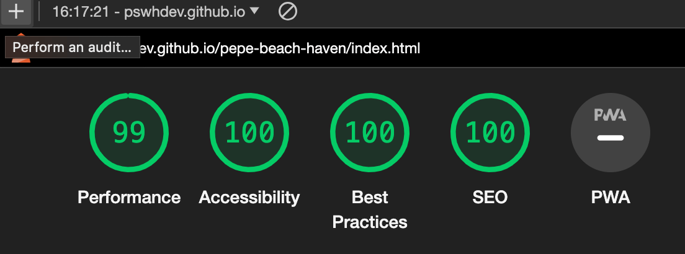
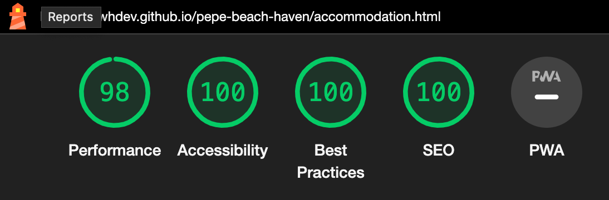

# Testing 

A series of manual tests were conducted to ensure the robust functionality and usability of the website. Each project feature, like navigation menu, links and form submissions were carefully examined to ascertain its proper operation and alignment with user needs.

The testing in different  browsers and diverse computers and mobile devices of different sizes and models show the website works reliably and effectivelly, providing users with a smooth navigation experience. The website is fully responsvive resizing the content of all pages according to the devices's screen sizes as can be seen on the images below.

### The home page:

### The accommodation page:

### The FAQ page:

### The contact us page:

### The thank you page:

## Validator Testing 

- HTML
  - No errors were returned when passing through the official W3C validator:

    - [Home page](https://validator.w3.org/nu/?doc=https%3A%2F%2Fpswhdev.github.io%2Fpepe-beach-haven%2Findex.html)

    - [Accommodation page](https://validator.w3.org/nu/?doc=https%3A%2F%2Fpswhdev.github.io%2Fpepe-beach-haven%2Faccommodation.html)

    - [Faq page](https://validator.w3.org/nu/?doc=https%3A%2F%2Fpswhdev.github.io%2Fpepe-beach-haven%2Ffaq.html)

    - [Contact page](https://validator.w3.org/nu/?doc=https%3A%2F%2Fpswhdev.github.io%2Fpepe-beach-haven%2Fcontact.html)

    - [Thank you page](https://validator.w3.org/nu/?doc=https%3A%2F%2Fpswhdev.github.io%2Fpepe-beach-haven%2Fthank.html)
  
- CSS
  - No errors were found when passing through the official [(Jigsaw) validator](https://jigsaw.w3.org/css-validator/validator?uri=https%3A%2F%2Fpswhdev.github.io%2Fpepe-beach-haven%2Findex.html&profile=css3svg&usermedium=all&warning=1&vextwarning=&lang=en)
  
- Lighthouse tests:
    - All pages were tested using the Lighthouse feature on Dev Tools from Google Chrome. The results can be seen on the pictures below. The pictures with a black backgroung are the results of tests conducted for desktop version whereas the ones with a white background are the results of tests for mobile version:

Home page:

Accomodation page:

FAQ page:

Contact page:

Thanks you page:

